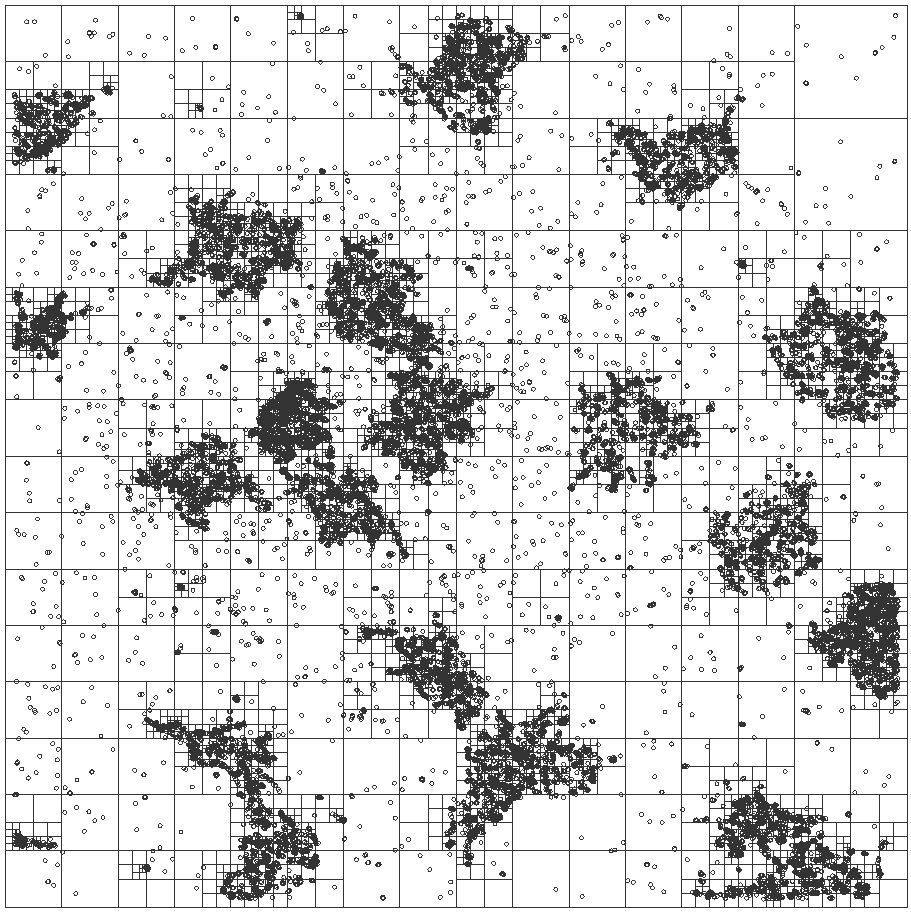

## Testing With Real Data

Now that the implementation of the quadtree is working for randomly generated 
data, the implementation was tested with some real data, as captured from STORM 
analysis of a sample. 

There are three files that have sample data in. The data generated by analysis 
of the images contains far more information than is currently used. The column 
headers are currently as follows:

| Header | Meaning | Used in Quadtree |
| :----- | :------ | :--------------: |
| Channel Name (I/E) | Wavelength channel that was used to capture data. First value, I, is the incident wavelength of the light used to excite the dye and the second, E, is the wavelength emitted that was imaged. | no |
| X | x-coordinate of point | no |
| Y | y-coordinate of point | no |
| Xc | centered, normalised x-coordinate of point | yes |
| Yc | centered, normalised y-coordinate of point | yes |
| Height | the height of the fitted gaussian peak used to extract the point from the original image | not yet |
| Area         | area of the point | not yet |
| Width        | full width half maximum of the point | not yet |
| Phi          | ? | no |
| Ax           | ? | no |
| BG           | ? | no |
| I            | ? | no |
| Frame        | ? | no |
| Length       | ? | no |
| Valid        | ? | no |
| Z            | ? | no |
| Zc           | ? | no |
| Photons      | ? | no |
| Lateral      | ? | no |
| Localisation | ? | no |
| Accuracy     | ? | no |
| Xw           | ? | no |
| Yw           | ? | no |
| Xwc          | ? | no |
| Ywc          | ? | no |

The three files are `1.txt`, `2.txt` and `3.txt`. In that order, these are the 
quadtrees that are generated when adding then with a new parser to extract only 
the Xc and Yc columns:

<!--
Created:  Fri 20 Jun 2014 04:11 PM
Modified: Fri 20 Jun 2014 04:26 PM
-->
