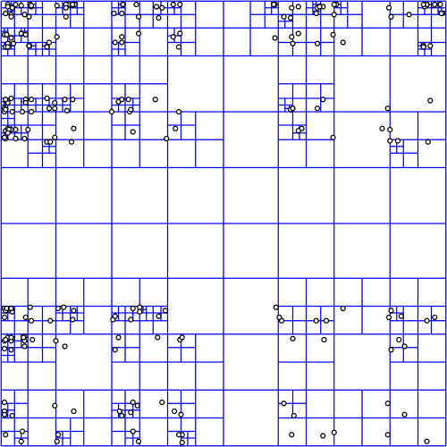

## Quadtrees

Quadtrees are a specific form of abstract data type derived from a general 
tree. Whereas each node in a tree can have any number of children, and each of 
those have zero or more children, there are certain types of tree with more 
strict rules that govern how they can be built. 

Binary trees are limited in that each node can have 0, 1 or 2 nodes. Quadtrees 
are similar in that they are limited to a maximum of 4 children per node, but 
also are limited since they have to have exactly 4 or exactly 0 children.

Quadtrees can be used for many purposes. Because they have 4 childrean, they 
are particularly good at partitioning 2 dimensional space since each child can 
represent a quadrant.

Here, a quadtree will be used to represent an image. The root node of the tree 
contains the whole image, each of the children a quarter and so on. By 
representing the image like this, information regarding the spatial index of 
features can be stored efficiently and then manipulated.

<!--
Created:  Thu 19 Jun 2014 08:43 PM
-->
