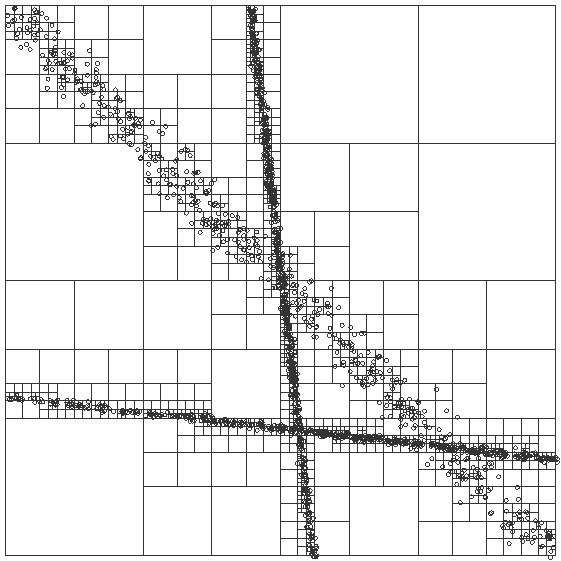

## Randomly Generated Data
Using R, a random data with a given range, and standard deviation can be used 
to test the quadtree.



To generate the data, use the following R snippet. This
1. generates a set of random numbers with the given properties,
1. selects from that data only the points where both the x- and the 
y-coordinate are both smaller than 100 and greater that 0,
1. plots this data to allow checking for sanity, and
1. writes the data to the file given.

```
x <- simcor(1000, 50, 65, 50, 65, 0.999)
y <- x[ x[,1]>0 & x[,1]<100 & x[,2]>0 & x[,2]<100, ]
plot(y)

write.table(y, file="data", sep=" ", row.names=F, col.names=F)
```

The simcor (simulate correlated data) from [here][simcor] function is defined 
as:

```
simcor <- function (n, xmean, xsd, ymean, ysd, correlation) {
    x <- rnorm(n)
    y <- rnorm(n)
    z <- correlation * scale(x)[,1] + sqrt(1 - correlation^2)
             * scale(resid(lm(y ~ x)))[,1]
    xresult <- xmean + xsd * scale(x)[,1]
    yresult <- ymean + ysd * z
    data.frame(x=xresult,y=yresult)
}
```

[simcor]: [http://stackoverflow.com/a/13292645]

<!--
Created:  Tue 17 Jun 2014 07:02 PM
Modified: Fri 20 Jun 2014 04:24 PM
-->
